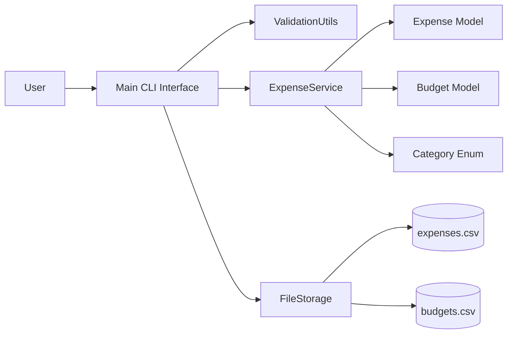
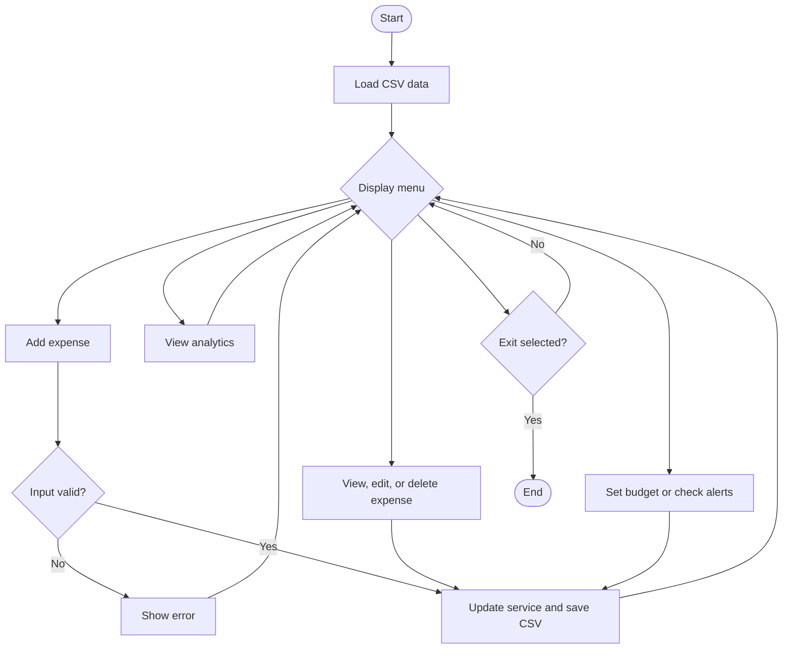
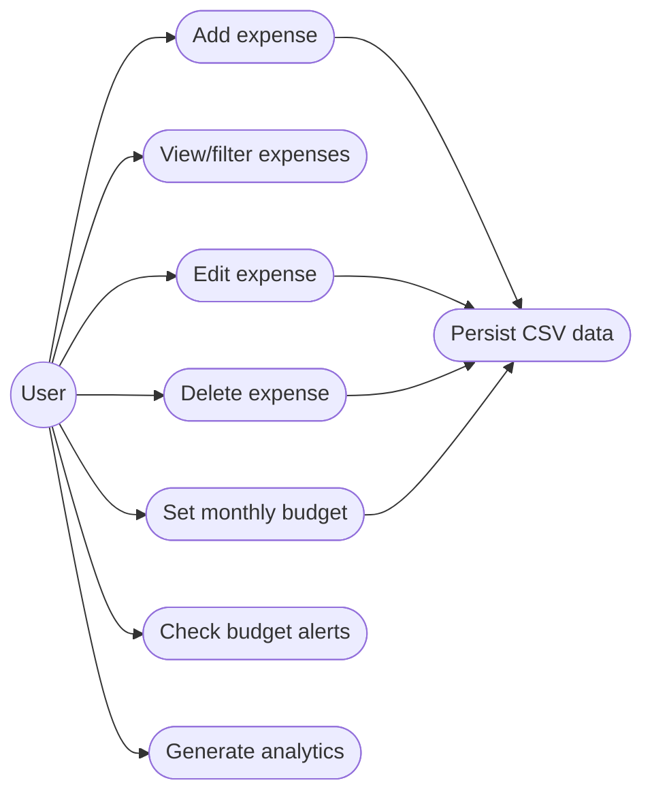
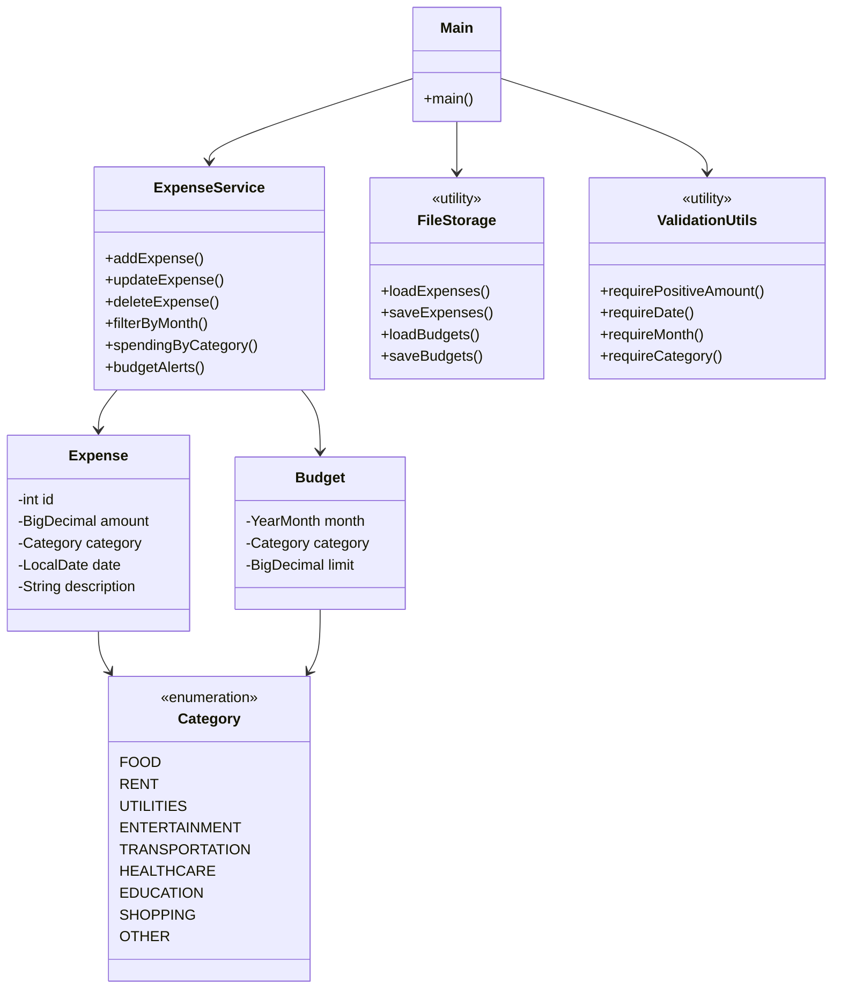
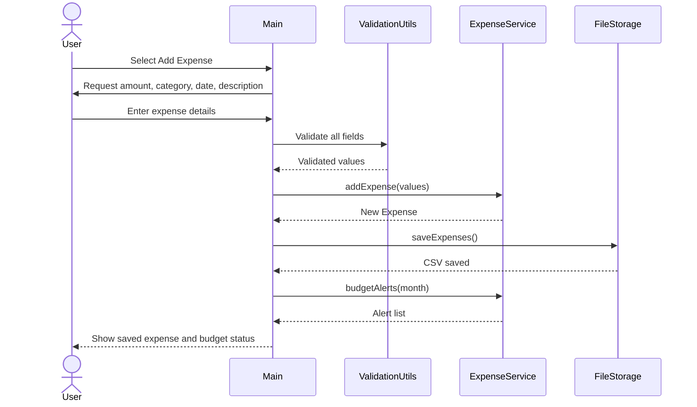

# Report Diagrams

## 1. System Architecture Diagram

```mermaid
flowchart LR
    User[User] --> Main[Main CLI Interface]
    Main --> Validation[ValidationUtils]
    Main --> Service[ExpenseService]
    Service --> Expense[Expense Model]
    Service --> Budget[Budget Model]
    Service --> Category[Category Enum]
    Main --> Storage[FileStorage]
    Storage --> ExpenseCSV[(expenses.csv)]
    Storage --> BudgetCSV[(budgets.csv)]
```

## 2. Process Flow / Workflow Diagram

```mermaid
flowchart TD
    Start([Start]) --> Load[Load CSV data]
    Load --> Menu{Display menu}
    Menu --> Add[Add expense]
    Menu --> Manage[View, edit, or delete expense]
    Menu --> Budget[Set budget or check alerts]
    Menu --> Analytics[View analytics]
    Add --> Validate{Input valid?}
    Validate -- No --> Error[Show error]
    Error --> Menu
    Validate -- Yes --> Save[Update service and save CSV]
    Manage --> Save
    Budget --> Save
    Analytics --> Menu
    Save --> Menu
    Menu --> Exit{Exit selected?}
    Exit -- No --> Menu
    Exit -- Yes --> End([End])
```

## 3. Use Case Diagram

```mermaid
flowchart LR
    User((User))
    Add([Add expense])
    View([View/filter expenses])
    Edit([Edit expense])
    Delete([Delete expense])
    SetBudget([Set monthly budget])
    Alerts([Check budget alerts])
    Reports([Generate analytics])
    Persist([Persist CSV data])
    User --> Add
    User --> View
    User --> Edit
    User --> Delete
    User --> SetBudget
    User --> Alerts
    User --> Reports
    Add --> Persist
    Edit --> Persist
    Delete --> Persist
    SetBudget --> Persist
```

## 4. Class Diagram

```mermaid
classDiagram
    class Expense {
        -int id
        -BigDecimal amount
        -Category category
        -LocalDate date
        -String description
    }
    class Budget {
        -YearMonth month
        -Category category
        -BigDecimal limit
    }
    class Category {
        <<enumeration>>
        FOOD
        RENT
        UTILITIES
        ENTERTAINMENT
        TRANSPORTATION
        HEALTHCARE
        EDUCATION
        SHOPPING
        OTHER
    }
    class ExpenseService {
        +addExpense()
        +updateExpense()
        +deleteExpense()
        +filterByMonth()
        +spendingByCategory()
        +budgetAlerts()
    }
    class FileStorage {
        <<utility>>
        +loadExpenses()
        +saveExpenses()
        +loadBudgets()
        +saveBudgets()
    }
    class ValidationUtils {
        <<utility>>
        +requirePositiveAmount()
        +requireDate()
        +requireMonth()
        +requireCategory()
    }
    class Main {
        +main()
    }
    Expense --> Category
    Budget --> Category
    Main --> ExpenseService
    Main --> FileStorage
    Main --> ValidationUtils
    ExpenseService --> Expense
    ExpenseService --> Budget
```

## 5. Sequence Diagram: Add Expense & Budget Check

```mermaid
sequenceDiagram
    actor User
    participant Main
    participant ValidationUtils
    participant ExpenseService
    participant FileStorage

    User->>Main: Select Add Expense
    Main->>User: Request amount, category, date, description
    User->>Main: Enter expense details
    Main->>ValidationUtils: Validate all fields
    ValidationUtils-->>Main: Validated values
    Main->>ExpenseService: addExpense(values)
    ExpenseService-->>Main: New Expense
    Main->>FileStorage: saveExpenses()
    FileStorage-->>Main: CSV saved
    Main->>ExpenseService: budgetAlerts(month)
    ExpenseService-->>Main: Alert list
    Main-->>User: Show saved expense and budget status
```
